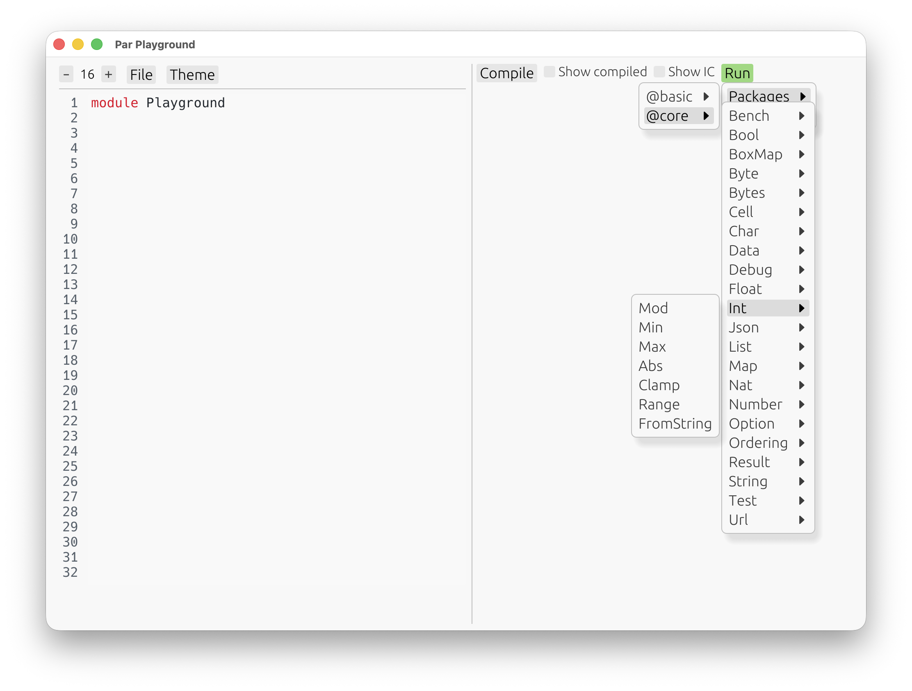
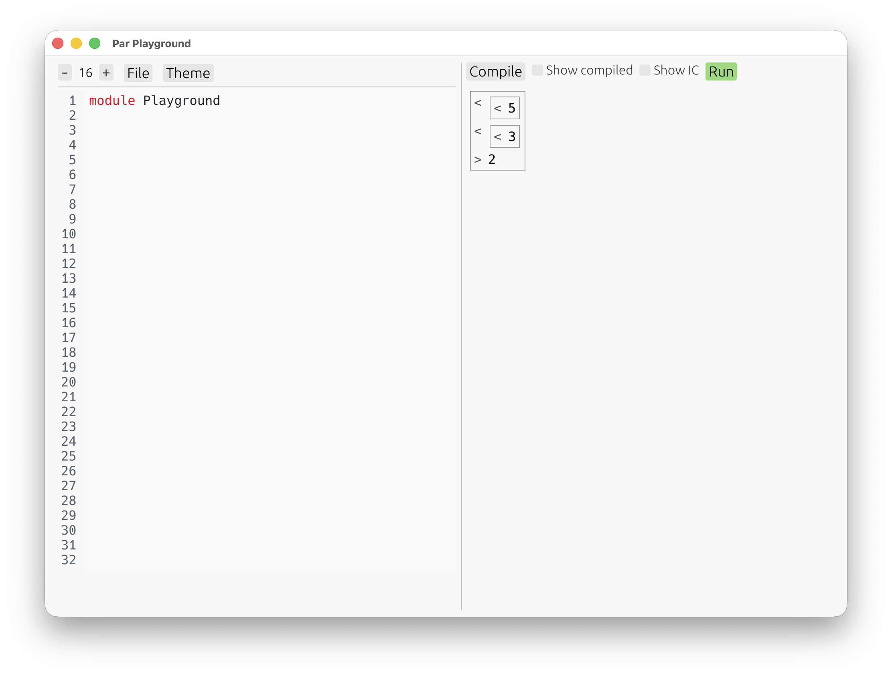

# 프로그램 기본 구조

나만의 패키지를 직접 작성하기 전에 우선 플레이그라운드에서 Par를 체험해 보는 것이 도움이 될 것이다.

아래 명령으로 플레이그라운드를 열어 보자.

```
$ par playground
```

**Compile**을 누르면 **Run** 메뉴에서 `core`의 내장 정의를 고를 수 있다.



첫 번째 예제로 `core` 패키지의 내장 산술 함수를 골라 보자. `Int.Mod`는 주어진 정수를 자연수로 나누었을 때 음이 아닌 나머지를 계산하는 함수이다.


**자동 UI**가 나타나 위에서 선택한 정의에 맞는 인자를 입력할 수 있다. 인자를 모두 입력하면 결과가 나타난다.



자동 UI는 Par 언어 자체가 아니라 **플레이그라운드**의 기능이다. `Int.Mod` 함수에 대해 누가 이런 형태의 인터페이스를 만들어둔 것이 아니고, 플레이그라운드가 이 함수의 타입(여기서는 두 수를 받아 자연수를 반환하는 함수)을 보고 함수와 상호작용할 수 있는 간단한 인터페이스를 알아서 생성한 것이다.

플레이그라운드의 자동 UI를 사용해 내장 정의뿐만 아니라 나중에는 직접 작성한 정의도 편리하게 확인할 수 있다.

다음 페이지에서는 새로운 패키지를 만들고 Par 모듈의 구조를 실제로 확인해 볼 것이다.