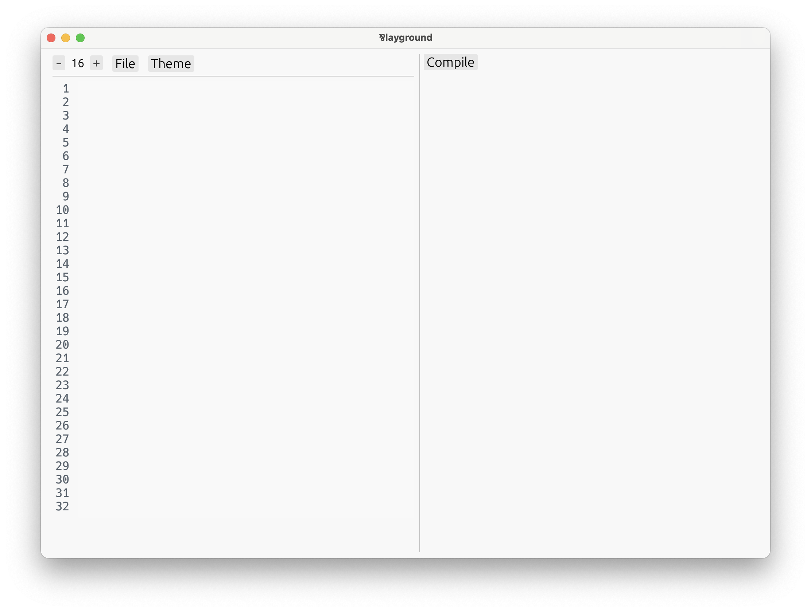

# 설치하기

이제 **Par** 프로그래밍 언어를 설치해 보자.

아직은 사전 빌드된 실행 파일이나 릴리즈가 없기 때문에 소스 코드에서 직접 컴파일해야 한다.

### 1. Rust와 Cargo 설치

Par는 [Rust](https://www.rust-lang.org)로 작성되었으므로, 소스 코드에서 직접 빌드하기 위해서는 Rust와 빌드 도구인 Cargo를 설치해야 한다.

Rust를 설치하는 가장 쉬운 방법은 [rustup](https://rustup.rs)이다. 웹사이트의 설명을 따르면 된다.

> 터미널에서 다음 명령을 실행하고 화면상의 지시를 따라 주세요.
>
> ```
> $ curl --proto '=https' --tlsv1.2 -sSf https://sh.rustup.rs | sh
> ```

### 2. Par 리포지토리 복제

그 다음에는 [GitHub](https://github.com/par-team/par-lang)에 있는 Par의 소스 코드를 내려받아야 한다. 터미널에서 다음 명령어를 실행해 소스 코드를 로컬로 복제할 수 있다.

```
$ git clone https://github.com/par-team/par-lang
```

### 3. Par의 CLI 도구 빌드 및 실행

새로 생성된 디렉토리로 이동한다.

```
$ cd par-lang
```

그 다음에는 Cargo로 실행 파일을 설치한다.

```
$ cargo install --path .
```

Rust가 의존성을 내려받고 빌드해야 하기 때문에 시간이 오래 걸릴 수 있다.

실행이 완료되면 `par` 명령이 설치된다.

### 4. Visual Studio Code 확장 설치

Visual Studio Code를 사용할 경우, [Par 확장](https://marketplace.visualstudio.com/items?itemName=par-lang.par-vscode)을 추가로 설치하면 문서를 읽으면서 문법 강조와 에디터 지원을 활용할 수 있다.

확장 설치는 필수가 아니며, 명령줄 도구는 확장이 없어도 사용할 수 있다.

### 5. 패키지 생성

여기까지 따라왔다면 터미널에서 `par` 명령을 사용할 수 있다. 명령이 생기지 않았다면 터미널을 닫은 뒤 다시 실행한다.

새로운 패키지를 만들어 보자.

```
$ par new hello_par
$ cd hello_par
```

명령을 실행하면 다음과 같은 디렉토리 구조가 생성된다.

```text
hello_par/
  Par.toml
  src/
    Main.par
```

`src/Main.par`라는 작은 Par 프로그램도 같이 생성되었으며, 다음 명령으로 지금 바로 실행해볼 수 있다.

```
$ par run
```

실행하는 대신 패키지 타입 검사만 해볼 수도 있다.

```
$ par check
```

### 6. 문서 읽어보기

Par에는 문서 탐색기가 내장되어 있다.

```
$ par doc
```

이 명령은 아래 세 가지 상황에 유용하게 사용할 수 있다.

- **패키지 바깥**에서 `par doc`을 실행하면 내장 패키지 문서를 확인할 수 있다.
- **패키지 안**에서 `par doc`을 실행하면 현재 패키지와 의존하는 패키지의 문서를 확인할 수 있다.
- **원격 패키지**의 경우, 의존성으로 직접 추가하지 않아도 `par doc --remote github.com/faiface/par-cancellable` 명령으로 패키지의 내용을 확인해볼 수 있다.

### 7. 플레이그라운드 실행

플레이그라운드는 자동 UI를 내장하고 있어 편리하게 코드를 작성해 보고 결과 값과 상호작용할 수 있다.

```
$ par-lang playground
```

아래와 같은 창이 나타난다면 정상이다.



잘 설치되었다면 다음 페이지에서 **언어에 발을 담가 보자!**

문제가 발생했다면 [디스코드](https://discord.gg/8KsypefW99) 서버(영어)에서 도움을 받을 수 있다.