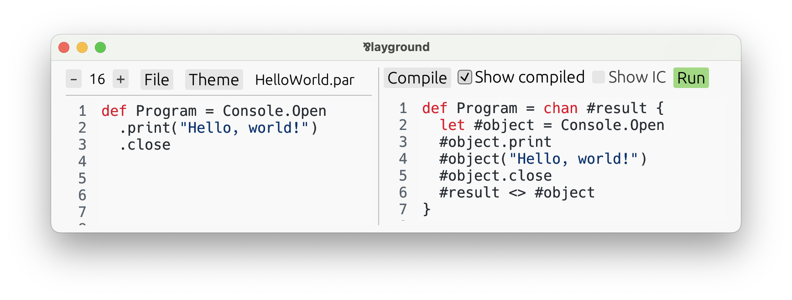

# 프로세스 문법

지금까지만 보면 *Par*는 명백하게 함수형 언어처럼 보인다. 물론 타입 시스템이 선형이고, [선택](./types/choice.md) 타입이나 이름 대신 `begin`/`loop`으로 재귀하는 [재귀](./types/recursive.md)·[반복](./types/iterative.md) 타입 등 특이한 기능이 있긴 하지만, 이를 고려하더라도 분명히 함수형 언어 같다.

사실은 그렇지 않다! **Par는 근본적으로 *프로세스 언어*이다!** 함수형 언어를 파고들면 [*λ(람다) 계산*](https://ko.wikipedia.org/wiki/람다_대수)이 이론적 기반이 되지만, Par의 기반은 [*π(파이) 계산*](https://en.wikipedia.org/wiki/Π-calculus)과 유사한 프로세스 언어인 *CP*이다. 프로세스 언어는 식으로 이루어지지 않고, 그 대신 동시성 프로세스와 채널, 그리고 송신과 수신 등 이에 대한 연산을 다룬다. *CP*는 저명한 컴퓨터과학자 [필립 워들러](https://en.wikipedia.org/wiki/Philip_Wadler)가 논문 [_'Propositions as Sessions'_](https://www.pure.ed.ac.uk/ws/portalfiles/portal/18383989/Wadler_2012_Propositions_as_Sessions.pdf)에서 구상한 언어로, 원래 실용적인 프로그래밍 언어의 기반이라는 역할은 같은 논문에서 소개한 함수형 언어인 *GV*가 맡는 것으로 되어 있었지만 *CP*에서 더 많은 가능성을 엿보았기 때문에 이쪽을 실용적인 언어로 만들기로 한 것이다.

그러면 Par는 어떻게 지금까지 함수형 언어로 완벽히 위장했던 것일까? 알고 보면 **지금까지 [타입과 식](./types_and_expressions.md)에서 다룬 *생성*과 *소멸* 문법 일체가 Par의 핵심인 프로세스 문법의 설탕이라고 생각할 수 있다.**

실질적으로 앞으로 작성할 Par 코드의 대부분은 *식 문법*이 되겠지만, 언어의 완전한 잠재력은 *프로세스 문법*에서만 끌어낼 수 있다. Par에서 표현할 수 있는 연산 중에는 지금까지 배운 것만으로는 아예 표현조차 하지 못하는 것도 많다.

## 그런데 프로세스 언어는 뭔가요?

가장 유명한 프로세스 언어는 의심의 여지 없이 [*π 계산*](https://en.wikipedia.org/wiki/Π-calculus)이라고 할 수 있다. 일반적으로 프로세스 언어를 이루는 개념은 다음과 같다.
- **프로세스**는 동시에 실행될 수 있는 독립적인 제어 흐름의 단위로, 서로 통신을 통해 상호작용한다.
- **채널**을 통해 통신이 일어난다. 같은 채널의 양끝에 있는 두 프로세스는 그 채널을 통해 정보나 심지어는 채널도 교환할 수 있다.
- **명령**은 프로세스가 실행하는 동작으로, 프로세스의 코드 역할을 한다. 무엇을 송신하고 무엇을 수신할지 등 채널을 사용해 어떻게 통신할지는 명령에 의해 결정된다.

위의 세 가지 개념 중 Par에서 지금까지 직접 보았던 것으로는 *채널*이 있다. 사실 [원시](./structure/primitive_types.md) 값을 제외하면 **Par의 모든 값은 채널이다**. [함수](./types/function.md), [순서쌍](./types/pair.md), [선택](./types/choice.md) 등 모든 값 말이다. 앞으로 프로세스 문법을 공부하면서 이 문장의 의미가 더 명확해질 것이다.

한편 프로세스와 명령은 지금까지 어느 정도 감추어져 있었다. Par에 항상 있던 개념이지만, 눈에는 보이지 않았을 것이다! 생성이든 소멸이든 모든 식은 항상 명령으로 이루어진 프로세스로 컴파일된다.

직접 확인해볼 수도 있다! 아무 Par 프로그램, 여기서는 `examples/HelloWorld.par`를 열어 보자.

```par
module HelloWorld

import @basic/Console

def Program = Console.Open
  .print("Hello, world!")
  .close
```

플레이그라운드에서 파일을 열고 **Compile**을 누른 뒤, **✔️ Show compiled** 체크박스를 체크해 보자.



오른쪽에 보이는 것은 같은 프로그램을 Par에서 제공하는 최소한의 프로세스 문법으로 컴파일한 것이다. 일부 변수 앞에 `#` 기호가 붙은 것을 제외하면(Par에서는 이름 충돌을 방지하기 위해 자동 생성된 이름에 이 기호를 사용한다) 올바른 Par 프로그램에 해당한다. `#` 기호를 지우면 다음과 같다.

```par
module HelloWorld

import @basic/Console

def Program = chan result {
  let object = Console.Open
  object.print
  object("Hello, world!")
  object.close
  result <> object
}
```

플레이그라운드에 복사해서 실행해 보자! 아무런 차이가 없는 같은 프로그램이다.

## 식 문법으로 충분하지 않나요? 왜 굳이 언어를 복잡하게 만드나요?

우선 식 문법으로는 충분하지 않다는 것부터 짚고 넘어가자. 지금까지 배운 순수 식 문법만으로는 모든 Par 프로그램을 표현할 수 없다.

하지만 더 중요한 점이 있다. **프로세스 문법을 잘 사용하면 프로그램을 더 읽기 좋게 만들 수 있다.** 무조건 프로세스 문법에만 의존하라는 것이 아니다! 프로세스 문법은 적절한 때에 식 문법과 신중하게 병용하여야 한다. Par에서는 **식과 프로세스 사이를 자연스럽게 오갈 수 있도록** 문법 기능을 제공하므로, 그때그때 상황에 맞는 문법을 세밀하게 선택할 수 있다.

[선택](./types/choice.md)과 [반복](./types/iterative.md) 값을 다룰 때는 프로세스 문법이 특히 궁합이 좋다. 두 무한수열을 원소 단위로 묶는 다음 함수를 보자.

```par
type Sequence<a> = iterative choice {
  .close => !,
  .next => (a) self,
}

dec Zip : [type a, type b, Sequence<a>, Sequence<b>] Sequence<(a, b)!>
def Zip = [type a, type b, seq1, seq2] begin case {
  .close =>
    let ! = seq1.close in
    let ! = seq2.close in !,

  .next =>
    let (x) seq1 = seq1.next in
    let (y) seq2 = seq2.next in
    ((x, y)!) loop,
}
```

이 함수는 `a`의 수열과 `b`의 수열을 하나씩 전달받아 순서쌍 `(a, b)!`의 수열을 생성한다. 수열을 닫을 때는 기반하는 두 수열 역시 닫는다(선형 값이므로 반드시 닫아야 한다). 다음 원소를 반환할 때는 양쪽 수열에서 값을 얻은 뒤 순서쌍을 만들어 반환한다.

이 코드 그대로도 실행과 이해에 문제가 없다. 하지만 프로세스 문법을 적당히 사용하면 더 좋은 코드가 된다!

```par
dec Zip : [type a, type b, Sequence<a>, Sequence<b>] Sequence<(a, b)!>
def Zip = [type a, type b, seq1, seq2] begin case {
  .close => do {
    seq1.close
    seq2.close
  } in !,

  .next => do {
    seq1.next[x]
    seq2.next[y]
  } in ((x, y)!) loop,
}
```

프로세스 문법이 낯선 지금은 선뜻 이해가 되지 않을 수 있지만, 이전의 코드에 비해 더 간결해진 것을 분명히 확인할 수 있다. 여기에서는 `seq1`과 `seq2`를 명시적으로 재대입하는 대신 다음 원소를 수신하는 명령을 수행하고 있으며, 이 과정에서 수열은 저절로 갱신된다.

여기에서 [**세션 타입**](https://en.wikipedia.org/wiki/Session_type)을 연관지을 수 있다. 이제 `seq1`을 채널로 취급해 보자. 우선 `.next` 신호를 전송해 다음 원소를 얻겠다는 의도를 표현한다. 그 다음에는 `[x]`를 통해 원소를 얻어 변수로 저장한다. [함수의 생성 문법](./types/function.md#construction)과 비슷해 보이는 것은 우연이 아니다!

**지금부터 프로세스 문법의 정체를 파헤쳐 보자!** 명령을 삽입해 기존 프로그램을 개선하는 것부터 시작하고, 끝까지 읽으면 **쌍대성**을 활용해 Par의 잠재력을 최대한 활용할 수 있을 것이다.
